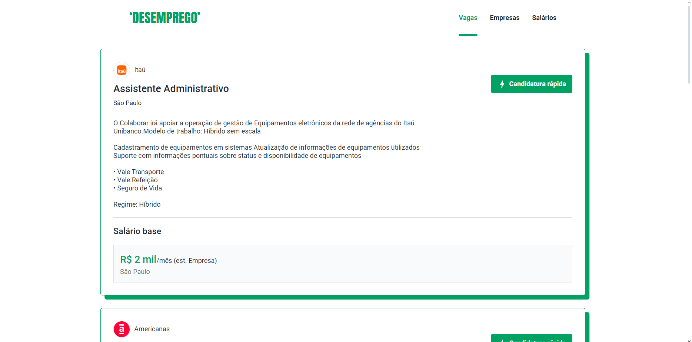
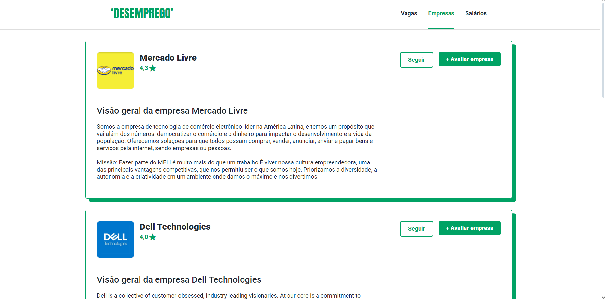
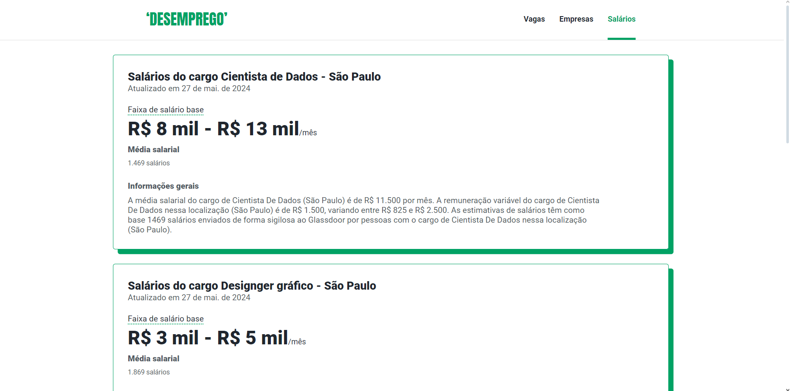

# Api de portal de vagas de emprego

## `Skills:`
* HTML, CSS, node.JS express, JavaScript

## `Considerações:`
* Esta foi minha primeira api desenvolvida como parte da disciplina de Linguagens de Script para Web da minha faculdade do curso de Sistemas para Internete e NÃO têm objetivo lucrativo.
* Toda a estrtura do site da api foi baseada no site de portal de vagas de empregos 'Glassdoor'.

## `Execução:`
* No terminal execute **npm init -y** para iniciar um novo projeto Node.js.
* Instale o Express para criar o servidor HTTP: **npm install express**.
* Instale o pacote cors para habilitar o CORS (Cross-Origin Resource Sharing): **npm install cors**.
* Ainda to terminal execute o seguinte comando: **node app.js**.
* Por fim navegue até o arquivo **index.html**.

## `Sobre a api:`
* Esta é uma api simples de portal de vagas de emprego, onde são apresentadas no total 4 páginas.
* Cada uma dessas páginas com excessão da página de formulário está obtendo dados de um arquivo.json
* Para isso é adicionado um script ao final de cada página HTML chamando a api que está em um arquivo.js
* Dentro deste arquivo.js é onde são chamados os dados que estão nos arquivos.json.

### Página de vagas:
* Na página de vagas (index.html) é apresentado na tela vagas de trabalho, com o nome da empresa e suas respectivas descrições.
* Cada dado é puxado de um arquivo vagas.json e a api é desenvolvida no arquivo index.js.

### Página de empresas:

* Na página de empresas é apresentado ma tela as informações de empresas todas obtidas a partir do arquivo empresas.json e a api desenvolvida no arquivo empresas.js.
  

### Página Salários:

* Na página de salários são apresentados dados da média de salários de seus respectivos cargos, assim como uma breve descrição com outras informações relacionadas a remuneração desses cargos.
* Todos os dados são obtidos a partir do arquivo salarios.json e a api desenvolvida no arquivo salarios.js.

### Página de formulário:

* Ao clicar em "candidatura rápida" na página de vagas o usuário é redirecionado para um formulário onde deverá preencher seus dados pessoais e enviar o currículo.

* Um script em form.js é necessário para que ao clicar em 'enviar candidatura' apareça uma caixa com a mensagem de que o formulário será enviado e caso seja confirmado pelo usuário os dados serão enviados, se não os dados não serão enviados, permitindo ao usuário a alteração dos mesmos e o reenvio do formulário.

